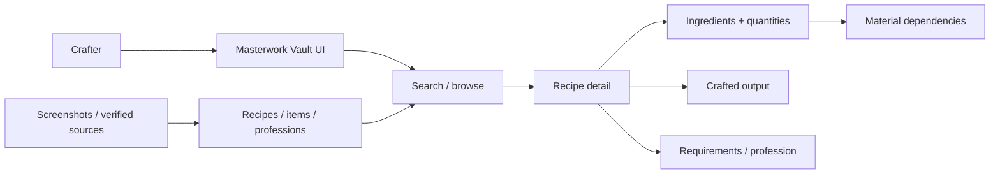
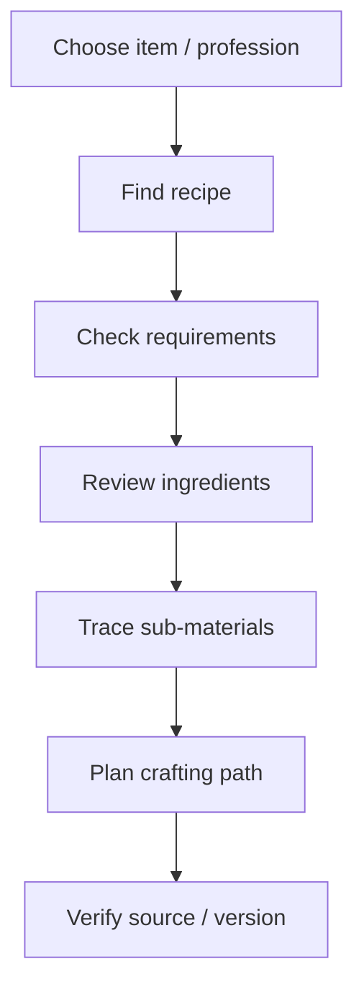

<div align="center">

# The Masterwork Vault

**A Neverwinter masterwork crafting reference for organizing recipes, ingredients, professions, item outputs, requirements, and source-aware crafting information.**

**Developed by Neverwinter player `Ar-chew`.**

</div>

## Overview

**The Masterwork Vault** is documented as a crafting knowledge system. A player should be able to start from an item or profession, understand required ingredients and relationships, trace dependencies, and distinguish verified recipe data from incomplete or version-sensitive information.

| Audience | Focus |
|---|---|
| Crafters / players | Find recipes, materials, requirements and outputs |
| Developers | Structured recipe/item data, dependency graphs, search and filtering |
| Designers | Dense crafting information, comparison, hierarchy and responsive navigation |
| Maintainers | Screenshot/source accuracy, quantities, variants and game-version changes |

<details open>
<summary><strong>🏗️ Interactive crafting architecture</strong></summary>



</details>

## Crafting flow



## Getting started

```bash
git clone <repository-url>
cd The-Masterwork-Vault
```

Use the manifests and lockfiles committed in the repository to determine the current runtime and commands.

## Data & design principles

Crafting data should stay explicit: item name, profession, recipe, ingredient quantities, requirements, outputs, variants, stats and source relationships should never be guessed. Keep dependency views readable, thumbnails associated with the correct records, missing data visible, and navigation useful on both desktop and mobile.

## SEO & discoverability

Use accurate terms such as **Neverwinter masterwork, masterwork crafting, Neverwinter crafting recipes, professions, crafting materials, masterwork ingredients, item recipes, and Neverwinter crafting guide** only where supported by verified project data.

## Contribution flow


